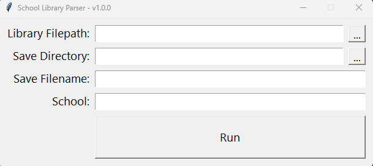

# SchoolLibraryParser
Tool for parsing school library list dumps. This takes in a file (dumped from school library websites) that looks like the following:
```
Catalog 
	
Library Search > Search Results 
	
Library Search
Destiny Discover
Resource Lists
	
How do I...  Destiny Help

Searched for (). Searched in: High Schools.	Printable 
[Not what you're looking for? Refine your search? Browse Authors?]	Selected List: My List   Add Page 

Titles: 1 - 4,999 of 4,999	Sort By 
Relevance
 Go! 	
1 	2 	3 	4 	67 	133 	200 	Show All

Cover image	
Come back to Afghanistan : trying to rebuild a country with my father, my brother, my one-eyed uncle, bearded tribesmen, and President Karzai     
   Book  	Call #: 92 AKB Akbar, Said Hyder
 	Sublocation: MEMOIR
 	Published 2006
 	Reading Level: 6.8
2 of 2 available
Add to this List 
 

Cover image	
The complete fables     
   Book  	Call #: 398.24 AES Aesop,
 	Sublocation: Folklore
 	Series: The Penguin classics
 	Published 1998
 	Reading Level: 4.0
 	Lexile: 1030L
2 of 2 available
Add to this List 
 
[continues until the end]

Cover image	
The complete history of costume & fashion : from ancient Egypt to the present day     
   Book  	Call #: 709 COS Cosgrave, Bronwyn
 	Sublocation: Arts
 	Published 2000
 	Reading Level: 11.5
3 of 3 available
Add to this List 

Titles: 1 - 4,999 of 4,999	
1 	2 	3 	4 	67 	133 	200 	Show All

©2002-2023 Follett School Solutions, LLC   20_0_4_AU4   11/4/2023 11:48 AM MDT
```
It then parses it, and stores the data in a CSV format for easy manipulation and analysis.

There are two versions to this: A CLI version and a GUI (tkinter) version.

## CLI Version
This can be run on any PC running Python version `3.7` or higher. Download the code, then open a command line and run the following:
- Navigate to the folder containing the code: `cd [path to SchoolLibraryParser folder]` 
- Type the following command to run the parser:
```python
python schoolLibraryParserCLI.py [-h] schoolName filepath savepath
```
__Inputs__
- schoolName -> Any text, will be added to every line indicating what school the book is in
- filepath -> The absolute path to the file that needs to be parsed
- savepath -> The absolute path (including the name of the file) to the file to create/save the results to

## GUI Version
Download the executable in release [TO BE ADDED]

The GUI version is meant to be an easy option for those that do not have Python setup on their laptops. It is deployed as an executable, and can be run on any mainline OS.



__Inputs__
- Library Filepath: The absolute path to the file that needs to be parsed
- Save Directory: The directory to save the results in
- Save Filename: The name of the file to save the results in. If you do not end this file with `.csv` it will fill it in for you.
- School: Any text, will be added to every line indicating what school the book is in
